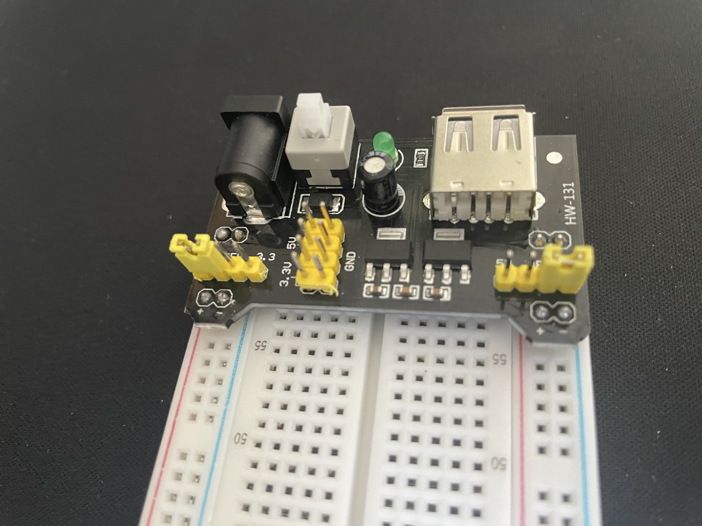
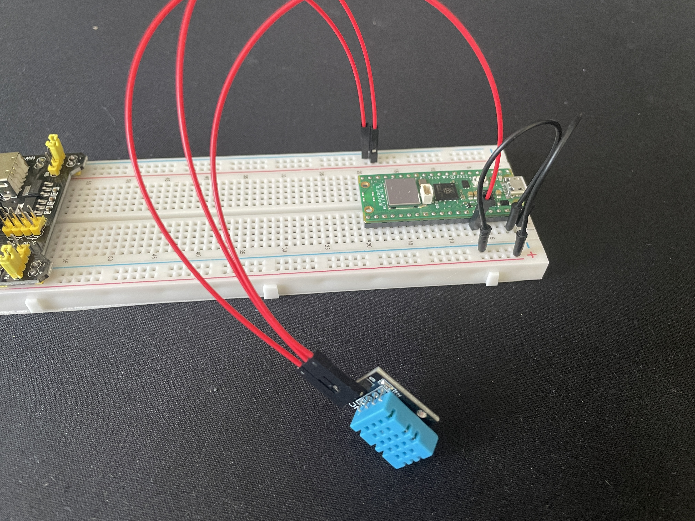

# An example temperature and humidity sensor on Raspberry Pi Pico W

## Prerequisites

- Hardware
  - [Raspberry Pi Pico](https://botland.com.pl/moduly-i-zestawy-do-raspberry-pi-pico/21575-raspberry-pi-pico-wh-rp2040-arm-cortex-m0-cyw43439-wifi-ze-zlaczami-5056561800196.html)
  - [Breadboard](https://botland.com.pl/plytki-stykowe/19943-plytka-stykowa-justpi-830-otworow-5904422328610.html)
  - [Connecting cables Male to Male](https://botland.com.pl/przewody-polaczeniowe-mesko-meskie/19950-przewody-polaczeniowe-mesko-meskie-justpi-65szt-5904422328665.html)
  - [Connecting cables Male to Female](https://botland.com.pl/przewody-polaczeniowe-zensko-meskie/11908-przewody-polaczeniowe-zensko-meskie-20cm-czerwone-100szt-5904422304447.html)
  - [Power supply](https://botland.com.pl/moduly-zasilajace/1482-modul-zasilajacy-do-plytek-stykowych-mb102-33v-5v-5904422300739.html)
  - [DHT11 temperature and humidity sensor](https://botland.com.pl/czujniki-multifunkcyjne/4918-czujnik-temperatury-i-wilgotnosci-dht11-modul-iduino-se052-5903351241335.html)
  - [LCD Display](https://botland.com.pl/wyswietlacze-alfanumeryczne-i-graficzne/2351-wyswietlacz-lcd-2x16-znakow-niebieski-konwerter-i2c-lcm1602-5904422309244.html)
- [Thonny IDE](http://thonny.org/)

## How to set it up

Step-by-step tutorial on how to set up the HW and SW.

First, check out the pico pinout schema:

### Connect the Power Supply

Connect the power supply to the breadboard.

Set up the bus strips of the breadboard's power supply as following:
- 3.3V for one side of the breadbord,
- 5V for the opposite one.

### Connect Raspberry Pi Pico

Place Raspberry Pi Pico on the breadboard and connect it to the power supply.

| Raspberry Pi  | Breadboard  |
|---------------|-------------|
| VSYS (Pin 39) |          +  |
| GND (Pin 38)  |          -  |

### Connect DHT11 sensor

DHT11's `S` pin needs to be connected to an `ADC` pin of Raspberry Pi.
`+` and `-` needs to be connected to the power supply.

| DHT11         | Connection       |
|---------------|-------------|
| - | - (Breadboard)  |
| + | + (Breadboard) |
| S | Pin 34 (GP28, ADC2) (Raspberry Pi) |

### Connect LCD Display

### Flash Raspberry Pi Pico with Micropython

Download the latest MicroPython UF2 bootloader from https://micropython.org/download/RPI_PICO/.

Connect your Raspberry Pi Pico to your computer via MicroUSB while pressing the BOOTSEL button on the board. You should see your Raspberry Pi Pico as a mass storage device now.

Drag and drop the UF2 bootloader to the mass storage. The board will disconnect and flash itself automatically.

### Upload the code

Using Thonny IDE, upload all the files from this repository to the Raspberry Pi Pico.

_Do not change the file names._

Reboot the device. You should see the output on your Lcd screen.

## License

All code in this repository is licensed under MIT license.

Special thanks to:
- https://github.com/dhylands/python_lcd for I2C LCD Api
- https://how2electronics.com/interfacing-dht11-temperature-humidity-sensor-with-raspberry-pi-pico/ for DHT11 Api